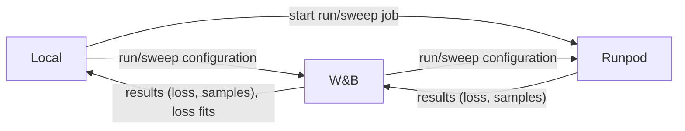

# Wavespace

**Overview**

* Self-education project on audio ML
* Explore datasets, training setups, SOTA methods
* Focus on pitch salience and piano-roll prediction
* Build end-to-end pipelines for experiments

**Key findings**

* Unsupervised training: Pitch salience prediction in latent space is difficult, because of the delicate tradeoff
  between latent space control and autoencoding fidelity.
* Supervised training: Conv models are often stronger than transformers. Transformers don't learn time dependent
  structures well in spectrograms, because consecutive frames are very close together as vectors.
* Automated tooling with YAML configs, W&B and parallel Runpod workers speeds up experiment cycle

**Tooling**

* One click scripts for local and remote runs
* W&B for tracking and sweeps
* Runpod for training on multiple workers
* GitHub and Codex workflows for iteration

## Shared Infrastructure

* Per-experiment packages hold model code, **Python** and **Torch**
* Python scripts trigger runs and sweeps
* **YAML configs** sent to **Weights & Biases (W&B)**
* Local or **Runpod** worker pulls config from W&B and trains
* Training streams losses and samples to W&B
* Post-processing scripts pull sweep data and compute fits
* **Docker** image for Runpod workers
* Datasets stored locally and on a Runpod volume

## Projects

### Autoencoding of spectrograms with UNet and ConvNet

* Warmup for working with sound, spectra and audio architectures
* Goal: Use a convolutional encoder-decoder and a UNet on spectrograms, check fidelity
* Dataset: Medley Solos DB, 21k samples, 2s duration, solos of 7 instruments & singer, 11 GB

### Pitch salience with UNet and linear reconstruction self supervised

* Dataset: Medley Solos DB, 21k samples, 2s duration, solos of 7 instruments & singer, 11 GB 
* Dataset: Maestro Dataset, piano recordings with Midi labels, 129 GB, processed to 10k chunks, 20s each, only samples

### Pitch salience with Encodec latents and transformer supervised

* Dataset: Synthetic non-Midi-pitch polyphonic samples, mixing pitches, durations, envelopes, timbres, 1 GB
* Dataset: Maestro Dataset, piano recordings with Midi labels, 129 GB, processed to 50k chunks, 10s each