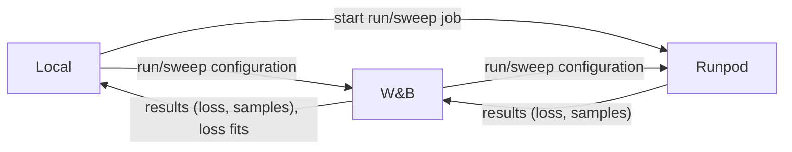
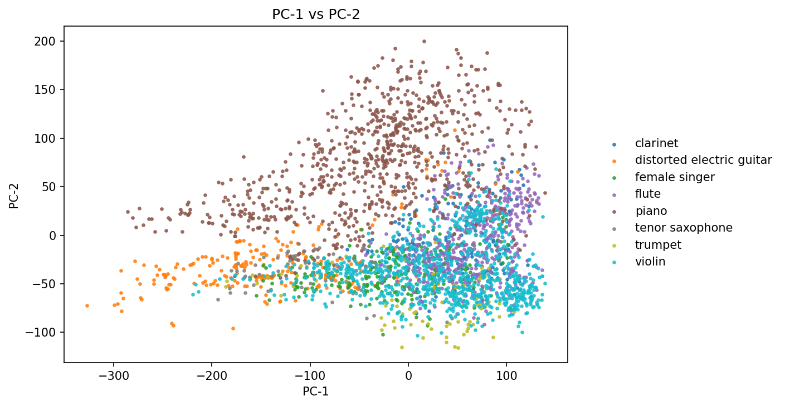
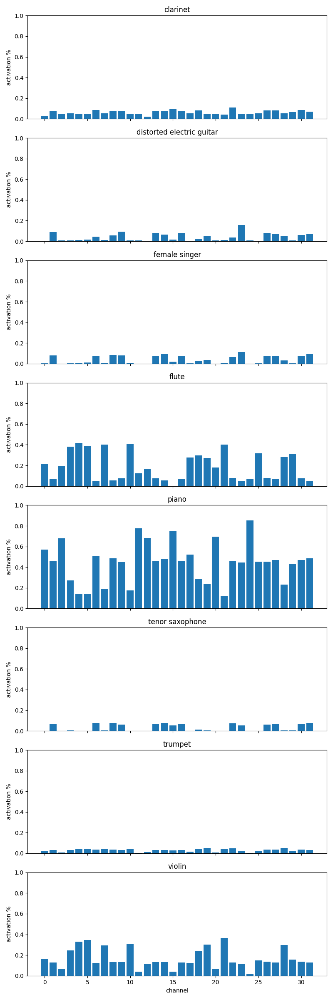
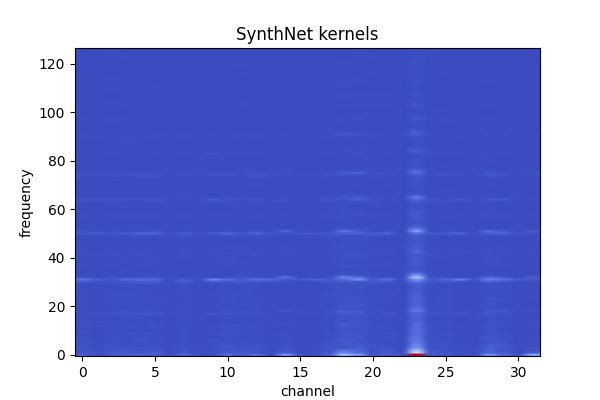
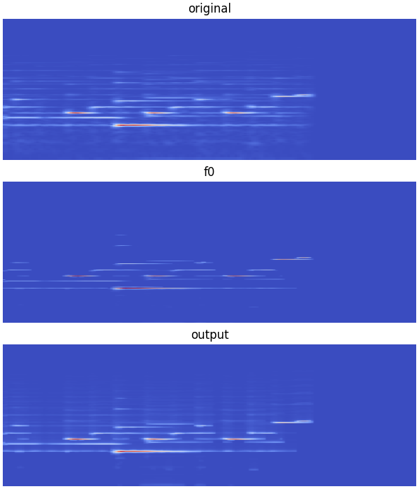
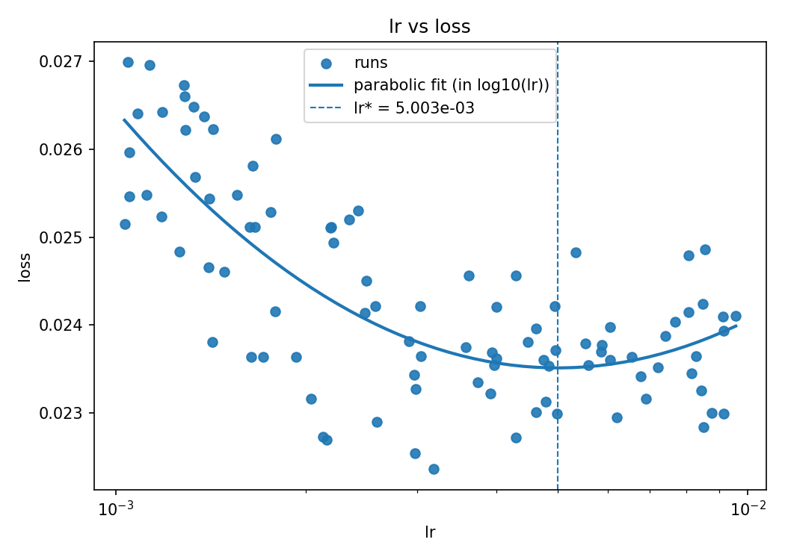
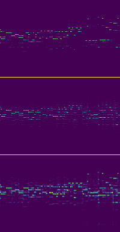

# Wavespace

**Overview**

* Self-education project on audio ML
* Explore datasets, training setups, SOTA methods
* Focus on pitch salience and piano-roll prediction
* Build end-to-end pipelines for experiments

**Key findings**

**Spectrogram autoencoders:** UNet variants reach high reconstruction fidelity (down to L1 ≈ 0.77), likely by bypassing the
bottleneck via skip connections, while plain ConvNets give more modest but stable reconstructions and a more regular
latent space, where singers already separate reasonably well from instruments.

**Unsupervised pitch salience:** A dual-gradient entropy constraint on the latent map produces interpretable,
instrument-specific channels and harmonic kernels and can suppress higher harmonics on piano to yield a clean f₀
saliency map, but it does not generalize as well to other instruments, suggesting limits from overtone structure and
dataset bias.

**Supervised pitch prediction:** In this setup, transformers on EnCodec latents and CQT spectrograms struggle to exploit
local temporal structure, show training instabilities, and stay well below state-of-the-art piano transcription
performance, while simpler convolutional and local-context models are often more robust.

**Infrastructure and experimentation:** YAML-configured sweeps, W&B tracking, and parallel Runpod workers make it cheap to
explore architectures, hyperparameters, and loss formulations end-to-end, and this automated tooling became a central
outcome of the project alongside the model results themselves.

**Tooling**

* One click scripts for local and remote runs
* W&B for tracking and sweeps
* Runpod for training on multiple workers
* GitHub and Codex workflows for iteration

## Shared Infrastructure

* Per-experiment packages hold model code, **Python** and **Torch**
* Python scripts trigger runs and sweeps
* **YAML configs** sent to **Weights & Biases (W&B)**
* Local or **Runpod** worker pulls config from W&B and trains
* Training streams losses and samples to W&B
* Post-processing scripts pull sweep data and compute fits
* **Docker** image for Runpod workers
* Datasets stored locally and on a Runpod volume

## Projects

### Autoencoding of spectrograms with UNet and ConvNet

#### Goal

This project explores spectrogram autoencoding using UNet variants and both 1D and 2D convolutional architectures. The
aim is to achieve high-fidelity reconstruction while gaining practical experience with spectrogram preprocessing, audio
datasets, and neural architectures.

#### Methods

* Dataset: Medley Solos DB, 21k samples, 2s duration, solos of 7 instruments & singer, 11 GB
* Samples: log-frequency spectrograms and melspectrograms, 256 frequency bins, 173 time bins
* Architectures: UNet, 1D- and 2D- ConvNets, up to 1024 channels
* Hyperparameter sweeps covered channel counts, learning rates, and batch sizes.

#### Results

**Figure 1:** PCA of UNet latent space distribution

UNet models produced strong fidelity, down to a L1-loss of 0.77, likely due to their skip-connection bypass paths, while
pure ConvNets achieved moderate but consistent reconstruction quality. Figure 1 shows a PCA of the latent space, showing
that the singer is relatively well separated from the other instruments in the latent space distribution.

### Pitch salience with UNet and convolution self supervised

#### Goal

The goal is to learn a UNet that maps spectrograms to an explicit, interpretable pitch-saliency map, and then
reconstructs the spectrogram by linearly combining this map with a bank of learned harmonic / timbre templates (
convolutional kernels for f0, f1, etc.). In this setup, the UNet output itself is the latent representation, and the
subsequent convolution with harmonic patterns acts as a simple, physically interpretable decoder that regenerates the
input while disentangling pitch and timbre structure.

#### Methods

* Use a dual (primal–dual) gradient method with an inequality constraint on the latent entropy to prevent mode collapse.
  Loss 0: reconstruction loss between input spectrogram and reconstruction (e.g. L1, L2, or BCE).
  Loss 1: entropy gap between the pitch-saliency latent and the input spectrogram, encouraging each harmonic structure
  to be encoded as a single f₀ peak.
* Minimize loss = loss0 + λ · loss1 while updating the non-negative multiplier λ with dual gradient ascent so that the
  entropy constraint (loss1 ≤ threshold) is satisfied and the optimization effectively focuses back on reconstruction
  once the constraint is met.
* Dataset: Medley Solos DB, 21k samples, 2s duration, solos of 7 instruments & singer, 11 GB
* Dataset: Maestro Dataset, piano recordings with Midi labels, 129 GB, processed to 10k chunks, 20s each, only samples
* Sweep for kernel initial value, learning rate, λ

#### Results

The approach worked to a meaningful extent: the model learned distinct timbre channels for different instruments, as
seen in histograms showing that instrument activity separated across latent channels (Figure 2). The spectral lines
are easily visible and differently weighed in the harmonic kernels (Figure 3). On piano spectrograms,
the encoding behaved as intended and visually suppressed f1, f2, etc., leaving a clean pitch-saliency map (Figure 4).
However, for other instruments, the model did not sufficiently remove the higher harmonics, and the latent map still
resembled a full spectrum rather than a clean, abstracted saliency representation. The reason may be that those other
instruments have a higher content in overtones or that the dataset was biased towards piano samples.

<table>
    <tr>
        <!-- First column: single image, Figure 2 -->
        <td style="width: 40%; vertical-align: top; text-align: center; padding: 8px;">
            <figure style="margin: 0;">
                
                <figcaption><b>Figure 2:</b> Histograms of channels split by instrument.</figcaption>
            </figure>
        </td>
        <!-- Second column: two images stacked, Figure 3 and Figure 4 -->
        <td style="vertical-align: top; text-align: center; padding: 8px;">
            <figure style="margin: 0 0 12px 0;">
                
                <figcaption><b>Figure 3:</b> Harmonic kernels with spectral lines.</figcaption>
            </figure>
            <figure style="margin: 10%;">
                
                <figcaption><b>Figure 4:</b> Piano sample spectrogram with pitch saliency and reconstruction.</figcaption>
            </figure>
        </td>
    </tr>
</table>

### Pitch salience with Encodec latents and transformer supervised

#### Goal

The goal was to learn supervised pitch-saliency predictors from audio, using both a synthetic dataset and the MAESTRO
piano recordings with MIDI labels as ground truth. In the first part, I worked on EnCodec latent representations and
compared several sequence architectures for pitch-saliency estimation (local-context MLP, dilated TCN, and transformer).
In the second part, I trained a transformer directly on CQT spectrograms to predict pitch saliency without going through
EnCodec latents.

#### Methods

* Preprocessing: Encodec pre quant latents, CQT spectrograms
* Dataset: Synthetic non-Midi-pitch polyphonic samples, mixing pitches, durations, envelopes, timbres, 1 GB
* Dataset: Maestro Dataset, piano recordings with Midi labels, 129 GB, processed to 50k chunks, 10s each
* Sweep fits for learning rate, weight decay, dropout rate (for example Figure 5)

**Figure 5:** Plot of loss vs learning rate

#### Results

In this simple approach transformers struggled to exploit temporal
structure in spectrograms and EnCodec latents, where consecutive frames are nearly collinear, and training sometimes
showed instabilities early or late in runs. On EnCodec latents, visual inspection suggested both precision and
sensitivity remained below about 60%. The CQT-based approach worked better, since piano CQT spectrograms already
resemble a pitch-saliency map (apart from some f1 resonances), but performance still fell well short of state-of-the-art
piano transcription, which reports above 90% precision and accuracy (Scoring Time Intervals using Non-Hierarchical
Transformer for Automatic Piano Transcription, Yujia Yan and Zhiyao Duan, 2024).

**Figure 6:** Sample of CQT-spectrogram input (bottom), transformer architecture output (middle) and label (pitch power
salience, top)
