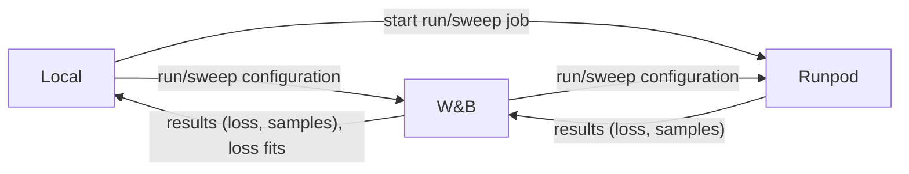

# Wavespace

**Overview**

* Self-education project on audio ML
* Explore datasets, training setups, SOTA methods
* Focus on pitch salience and piano-roll prediction
* Build end-to-end pipelines for experiments

**Key findings**

* Unsupervised pitch learning in latent space difficult
* Autoencoding vs latent structure needs tradeoff
* Supervised training simpler
* Conv models often stronger than transformer baselines
* Tooling with YAML configs and wandb control speeds up experiment cycle

**Tooling**

* Pipeline for local and remote runs
* wandb for tracking and sweeps
* runpod for training
* GitHub and Codex workflows for iteration

## Shared Infrastructure

* Per-experiment packages hold model code, **Python** and **Torch**
* Python scripts trigger runs and sweeps
* **YAML configs** sent to **Weights & Biases (W&B)**
* Local or **Runpod** worker pulls config from W&B and trains
* Training streams losses and samples to W&B
* Post-processing scripts pull sweep data and compute fits
* **Docker** image for Runpod workers
* Datasets stored locally and on a Runpod volume

## Projects

### Autoencoding of spectrograms with UNet and ConvNet

### Pitch salience with UNet and linear reconstruction self supervised

### Pitch salience with Encodec latents and transformer supervised
